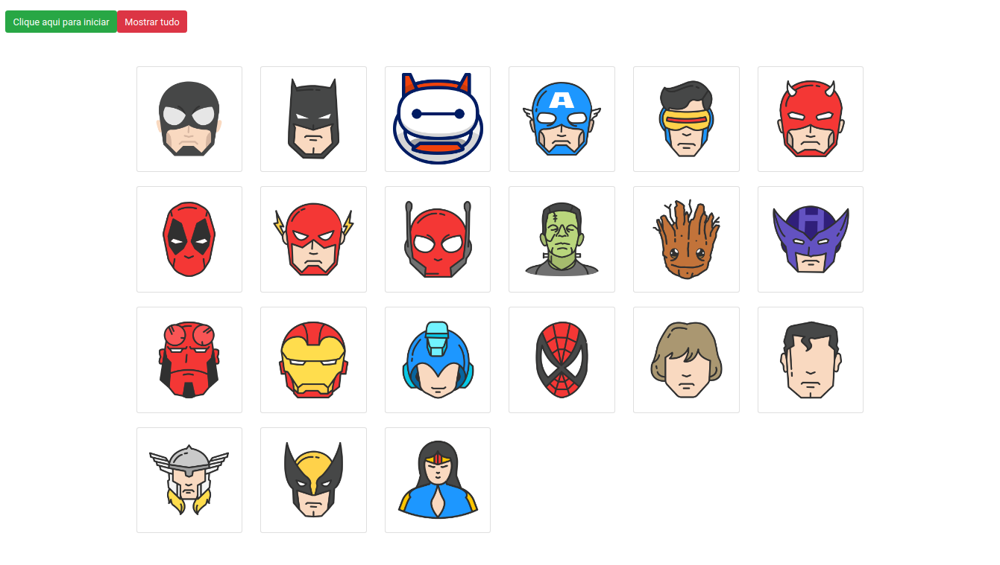

<h1 align="center">
  🎮🎲️🦸 Heroes Memory Game 🦸‍♀️🎯🕹️
</h1>

<p align="center">
  

  

  

  
</p>



<h3 align="center">
  <a href="https://jerp86.github.io/fundamentosjs-jogo-da-memoria/">Acessar o game</a>
</h3>

---

[](https://app.codacy.com/manual/jerp86/fundamentosjs-jogo-da-memoria?utm_source=github.com&utm_medium=referral&utm_content=jerp86/fundamentosjs-jogo-da-memoria&utm_campaign=Badge_Grade_Dashboard)

# Indice

- 🎮️ [Sobre](#%EF%B8%8F-sobre)
- 👨‍💻️ [Tecnogias utilizadas](#%EF%B8%8F-tecnogias-utilizadas)
- 📦️ [Como baixar o projeto](#%EF%B8%8F-como-baixar-o-projeto)
- 🤔️ [Como contribuir](#%EF%B8%8F-como-contribuir)

---

## 🎮️ Sobre

O projeto **Heroes Memory Game** é um jogo da memória que foi criado dentro do curso de **Fundamentos de JavaScript** do Erick Wendel com o intuito de colocar em prática todo o conteúdo estudado durate o curso.

---

## 👨‍💻️ Tecnogias utilizadas

O projeto foi desenvolvido utilizando as seguintes tecnologias:

- [Javascript](https://www.javascript.com/)
- [Visual Studio Code](https://code.visualstudio.com/)
- [Editor Config](https://editorconfig.org/)
- [Prettier](https://prettier.io/)

---

## 📦️ Como baixar o projeto

```bash
  # Clonar o repositório
  $ git clone https://github.com/jerp86/fundamentosjs-jogo-da-memoria.git

  # Entrar no diretório
  $ cd fundamentosjs-jogo-da-memoria

  # Iniciar o projeto
  $ firefox index.html
  # ou pode utilizar
  $ google-chrome index.html
```

---

## 🤔️ Como contribuir

1. Faça o `fork` deste repositório
2. Crie uma branch com sua feature:
   - `$ git checkout -b minha_feature`
3. Confirme sua branch:
   - `$ git commit -m "feature: Meu novo recurso"`
4. Envie sua branch:
   - `$ git push origin minha_feature`

---

<h4 align="center">
  Feito com ❤️ por Jerp86 👋️ <a href="mailto:jerp4@hotmail.com">Entre em contato!</a>
</h4>

<p align="center">
  <a href="https://www.linkedin.com/in/jerp/">
    
  </a>
  <a href="https://www.facebook.com/jerpbtu">
    
  </a>
  <a href="https://www.instagram.com/jerpbtu/">
    
  </a>
</p>
